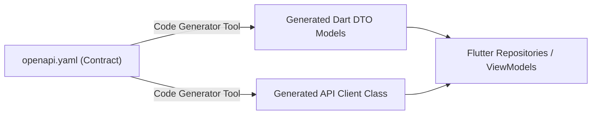

# OpenAPI (Swagger) Complete Learning & Interview Guide

This guide is designed to give you complete clarity and handholding on **OpenAPI (formerly Swagger)**, how contract-first API development works, how to read/write OpenAPI specifications, and how to use Flutter API generators to generate code automatically.

---

## 1. What is OpenAPI / Swagger?

### Definition
**OpenAPI Specification (OAS)** is a standard, language-agnostic interface description format for RESTful APIs. It allows humans and computers to understand the capabilities of a service without access to source code, documentation, or network traffic inspection.

### Why Tech Companies Use OpenAPI (Key Interview Talking Point)
In modern software engineering, companies use **Contract-First API Design**:
1. **Frontend & Backend Decoupling**: Frontend (Flutter, React) and Backend (Node.js, Go, Python, Java) teams agree on the OpenAPI contract (`openapi.yaml`) *before* writing code.
2. **Automated Code Generation**: Developers generate client SDKs, models, and server stubs directly from the `.yaml` file, eliminating manual serialization bugs.
3. **Single Source of Truth**: Documentation (Swagger UI, Redoc) is rendered live from the contract, ensuring documentation never gets out of date.
4. **Mock Servers**: Frontend teams can spin up a mock server from the spec to build UI features before the real backend is deployed.

---

## 2. Breakdown of the OpenAPI Document (`openapi.yaml`)

Every OpenAPI 3.0 document has 6 main root blocks:

```yaml
openapi: 3.0.3                       # 1. Spec Version
info:                                # 2. API Metadata (Title, Version, Description)
  title: Reestoko REST API
  version: 1.0.0

servers:                             # 3. Target Environment Base URLs
  - url: https://api.reestoko.app/v1

paths:                               # 4. Endpoints & HTTP Operations (GET, POST, PUT, DELETE)
  /households/{householdId}/inventory:
    get:
      summary: List inventory items
      operationId: getInventoryItems # Used by Code Generators as the Dart method name!

components:                          # 5. Reusable Schemas, Parameters, Security Schemes
  schemas:
    InventoryItem:
      type: object
      properties:
        id: { type: string }
        name: { type: string }
  securitySchemes:
    BearerAuth:
      type: http
      scheme: bearer

security:                            # 6. Global Security Application
  - BearerAuth: []
```

---

## 3. Key Concepts to Know for Interviews

### A. HTTP Methods & Idempotency
- **GET**: Read data. Idempotent (calling it 1x or 100x produces the same result without side effects).
- **POST**: Create a new resource. Non-idempotent.
- **PUT**: Replace/Update a resource entirely. Idempotent.
- **PATCH**: Partial update of a resource fields.
- **DELETE**: Remove a resource. Idempotent.

### B. Request Parameters vs Request Body
- **Path Parameters**: `/households/{householdId}/inventory/{itemId}` (Identifies specific resources).
- **Query Parameters**: `/inventory?zoneId=fridge&status=LOW_STOCK` (Filtering, sorting, pagination).
- **Header Parameters**: `Authorization: Bearer <token>`, `Accept-Language: en`.
- **Request Body**: JSON payload sent in `POST` / `PUT` requests.

### C. HTTP Status Codes
- `200 OK`: Request succeeded.
- `201 Created`: Resource successfully created.
- `204 No Content`: Successful deletion or action with no response body.
- `400 Bad Request`: Validation failure or malformed body.
- `401 Unauthorized`: Token missing or invalid.
- `403 Forbidden`: Authenticated, but user lacks permission for this resource.
- `404 Not Found`: Resource does not exist.
- `500 Internal Server Error`: Server failure.

---

## 4. How Flutter API Generator Works

### Workflow Overview


### Steps in Flutter:
1. Define your `openapi.yaml` spec.
2. Configure `pubspec.yaml` with packages like `dio` and `swagger_parser` (or `openapi_generator_cli`).
3. Run code generation command:
   ```bash
   flutter pub run build_runner build --delete-conflicting-outputs
   ```
4. The generator inspects `operationId` in the YAML (e.g. `getInventoryItems`) and creates strong type-safe methods:
   ```dart
   Future<List<InventoryItem>> getInventoryItems({
     required String householdId,
     String? zoneId,
     String? status,
   });
   ```

---

## 5. Cheat Sheet: Explaining OpenAPI in an Interview

> **Q: "How do you handle API contracts between frontend and backend in mobile development?"**
> 
> **Sample Answer:**
> *"We follow a contract-first approach using OpenAPI 3.0. We define the endpoints, request/response schemas, authentication, and HTTP status codes in a shared YAML specification. 
> On Flutter, we use an API generator tool (like swagger_parser or openapi_generator) via build_runner. This automatically generates our Dart data models and Dio client methods directly from the spec. 
> This eliminates manual JSON parsing errors, guarantees type safety, and allows frontend developers to write mock tests before the backend endpoints are fully deployed."*
