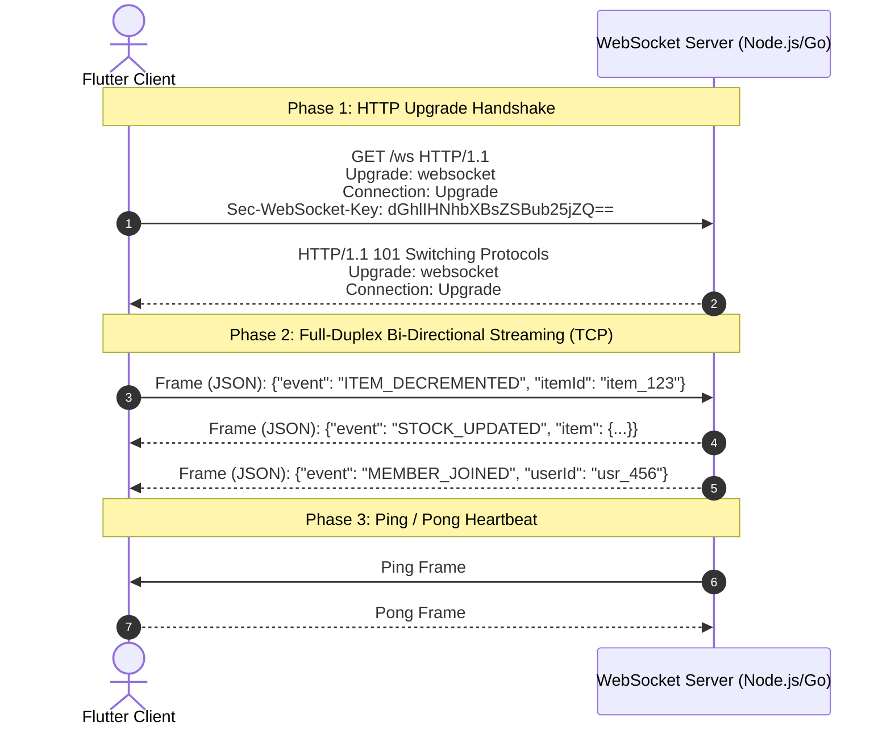

# WebSocket Technology Feasibility & Educational Guide

This document provides an in-depth feasibility assessment of **WebSocket technology** for **Reestoko**, comparing custom WebSockets against Cloud Firestore real-time listeners (`snapshots()`). It is structured as both a technical design document and a comprehensive interview prep guide.

---

## 1. Core Technical Fundamentals: What is a WebSocket?

### Definition
A **WebSocket** is a computer communications protocol providing **full-duplex**, **persistent**, **low-latency** communication channels over a single TCP connection.

### How WebSockets Work Under the Hood (Step-by-Step)

1. **HTTP Handshake**: The client sends a standard HTTP GET request with `Upgrade: websocket` and `Connection: Upgrade` headers.
2. **101 Switching Protocols**: The server responds with `HTTP 101 Switching Protocols`. The underlying TCP socket connection remains open.
3. **Bi-Directional Framing**: Data is sent as lightweight binary or text frames in real time without HTTP header overhead.
4. **Heartbeat (Ping/Pong)**: Small control frames sent periodically to detect dropped connections (e.g. device switching Wi-Fi to 5G).

---

## 2. Comparison Matrix: WebSockets vs Cloud Firestore `snapshots()` vs REST Polling

| Feature / Criteria | Custom WebSockets (`web_socket_channel`) | Cloud Firestore Real-time (`snapshots()`) | Traditional REST Polling |
| :--- | :--- | :--- | :--- |
| **Protocol** | WS / WSS (TCP Socket) | gRPC / WebSockets over HTTP/2 | Standard HTTP GET (TCP connection per request) |
| **Data Direction** | Full-Duplex (Client ↔ Server) | Bi-directional streaming | Half-Duplex (Client Request → Server Response) |
| **Latency** | Extremely Low (< 20ms) | Low (~ 50-150ms) | High (Depends on poll interval, e.g. 5-30s) |
| **Header Overhead** | ~2 to 10 bytes per frame | Low (Multiplexed gRPC) | High (~500+ bytes headers per request) |
| **Offline Persistence** | Manual (Requires custom SQLite/Hive caching) | **Built-in Native** (Firestore offline cache & delta sync) | Manual |
| **Backend Maintenance** | **High** (Must manage WS servers, state, load balancers, Redis Pub/Sub) | **Zero** (Managed serverless cloud service) | Low/Medium |
| **Scalability Cost** | Linear VM/Socket memory cost | Pay per document read/write operation | Server bandwidth & server load |

---

## 3. Feasibility Analysis for Reestoko

### Scenario A: Reestoko Using Cloud Firestore (`snapshots()`)
- **Pros**:
  1. Firestore SDK already uses long-lived connections (WebSockets / HTTP/2 gRPC streaming) internally.
  2. Automatic offline support: When a user decrements milk quantity in a basement pantry with no cellular signal, Firestore queues the change locally and syncs automatically when reconnected.
  3. Zero backend code required for pub/sub server infrastructure.
- **Cons**:
  1. Every real-time update triggers a document read for listening clients (incurring Firestore read costs if hundreds of changes occur per minute).

### Scenario B: Reestoko Using Custom WebSockets
- **When is a custom WebSocket necessary?**
  1. Real-time collaborative typing or live barcode scanning streams between family members.
  2. Live presence indicators (e.g., "Alex is currently editing the Fridge list").
  3. Custom WebSocket microservice handling third-party smart fridge IoT telemetry data.

---

## 4. Key Interview Questions & Talking Points

> **Q1: "Explain how a WebSocket connection is established."**
> 
> *Answer:*
> *"It begins with an HTTP GET request containing Upgrade headers (`Upgrade: websocket`, `Connection: Upgrade`) and a base64 `Sec-WebSocket-Key`. The server responds with `101 Switching Protocols`, upgrading the HTTP connection to a persistent TCP socket channel. From that point, data flows in binary or text frames with minimal overhead without renegotiating HTTP headers."*

---

> **Q2: "How do you handle dropped connections or network switches in WebSockets on mobile?"**
> 
> *Answer:*
> *"Mobile devices frequently switch networks (Wi-Fi to 5G) or enter sleep modes. We implement:*
> 1. *Ping/Pong Heartbeats (every 30s) to detect stale sockets.*
> 2. *Automatic Reconnection with Exponential Backoff (e.g. retrying after 1s, 2s, 4s, 8s up to a cap).*
> 3. *State Synchronization on reconnect: Sending a last-received sequence number or timestamp to request missed updates."*

---

> **Q3: "Why choose Firestore listeners over raw WebSockets for a smart home inventory app?"**
> 
> *Answer:*
> *"While both use long-lived socket connections, Firestore listeners provide built-in offline persistence and delta updates out of the box. Building raw WebSockets requires writing custom socket servers, Redis Pub/Sub scaling, and manual local SQLite caching for offline changes."*
